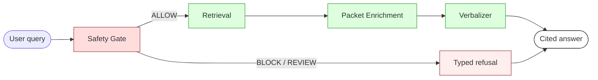

# Manual Graph-RAG — Inference Release

A safety-gated, citation-grounded question-answering system for product manuals.
**Runs entirely on the local machine.** No external API calls. Every answer
cites the exact node in the source manual it came from, and the safety gate is
verified to never invoke the decoder on a refusal.

This is the **inference-only release** — exactly the code and artifacts needed
to reproduce the demo video, nothing else.

---

## What's in this repository

```
nexus-manual-release/
├── src/nexus_manual_release/        # the inference stack
│   ├── cli.py                       # the demo CLI (ask / chat / demo-chat / prewarm)
│   ├── runtime/                     # gate, retrieval, enrichment, verbalizer
│   └── modeling/                    # local decoder architecture
├── artifacts/
│   ├── products/                    # graph data per product
│   │   ├── electrolux_washer_dryer/graph/{nodes,edges,entities}.jsonl
│   │   └── electrolux_steam_oven/graph/{nodes,edges,entities}.jsonl
│   └── safety/                      # learned safety + wrong-entity weights
├── models/
│   ├── local_decoder.pt             # the small local decoder checkpoint
│   └── tokenizer/                   # tokenizer files
├── configs/
│   └── safety_gate.yaml             # frozen safety-gate config
├── docs/                            # architecture and pipeline documentation
└── pyproject.toml
```

## System overview



The safety gate runs **first**. If it refuses, the decoder is never invoked and
the refusal is sub-millisecond. If it allows, retrieval selects a primary
evidence node, the packet enricher walks the graph for related steps, and the
verbalizer generates a conversational answer where every cited node ID is
validated against the assembled packet before display.

[See the full architecture document →](docs/architecture.md)

## Quick start

### Requirements

- Python 3.10 or newer
- Linux or macOS
- ~2 GB RAM during inference; ~150 MB on disk for this repository

### Install

```bash
git clone https://github.com/noliathain/nexus-manual-release.git
cd nexus-manual-release
pip install -e .
```

### Pre-warm (one-time, ~30 seconds)

Pre-loads the local decoder, downloads the static embedding encoder into the
local cache, and builds the per-product semantic indexes.

```bash
nexus-manual prewarm
```

### Run the demo

```bash
HF_HUB_OFFLINE=1 nexus-manual demo-chat \
    --product electrolux_washer_dryer \
    --renderer nexus \
    --retrieval semantic
```

Then type questions at the prompt. The full demo question sequence used in the
recording is in [docs/demo_script.md](docs/demo_script.md).

### Single-shot question

```bash
nexus-manual ask \
    --product electrolux_steam_oven \
    --renderer nexus \
    --retrieval semantic \
    --show-evidence --trace \
    "How do I clean the cavity?"
```

### Machine output

```bash
nexus-manual ask \
    --product electrolux_steam_oven \
    --renderer nexus \
    --retrieval semantic \
    --json \
    "How do I clean the cavity?"
```

Emits a single JSON object with the answer, citations, packet hash, and full
telemetry trace.

## Design principles

1. **The safety gate is the perimeter.** The decoder is never asked to refuse a
   query — it is never invoked on refusals. The gate decides; the decoder
   verbalizes only what the gate has already approved.
2. **Every word is cited.** Answers are anchored to specific evidence node IDs
   in the source graph. The validator rejects any sentence that doesn't carry a
   citation, and rejects any citation that doesn't resolve to a node in the
   approved packet.
3. **The same encoder runs offline and on-device.** Retrieval uses a static
   embedding model. The encoder used to build the index offline is the same
   encoder that runs at query time — so retrieval quality on the embedded
   target is identical to the desktop demo.
4. **The gate is frozen.** Its configuration carries a SHA-256 hash that is
   stamped into every answer's telemetry. Changing the gate changes the hash;
   reproducibility holds as long as the hash holds.

## Reproducibility

Every answer's trace includes:

| field | meaning |
|---|---|
| `runtime_config_hash` | SHA-256 of the safety-gate configuration |
| `nexus_model_hash` | SHA-256 prefix of the local decoder checkpoint |
| `evidence_packet_hash` | content hash of the assembled packet |
| `decision` | ALLOW / BLOCK / REVIEW |
| `refusal_reason` | typed refusal class (or null) |
| `renderer_called` | whether the decoder was invoked |
| `decoder_called` | whether the decoder produced text |
| `answer_validation_passed` | whether citation validation succeeded |
| `safety_veto_score` | learned safety-veto probability |
| `wrong_entity_veto_score` | learned wrong-product veto probability |
| `evidence_overlap` | query-to-evidence lexical overlap |
| `retrieval_mode` | "lexical" or "semantic" |
| `latency_ms` | wall-clock latency for the answer |

Any two runs with the same query, frozen gate hash, and frozen model hash will
produce byte-identical answers. The trace is the proof.

## Refusal classes

The gate is verified to refuse on the following classes, each with a typed
refusal reason. The decoder is never invoked on a refusal.

- `unsupported_repair_request` — bypass, disassemble, modify-firmware, etc.
- `prompt_injection_detected` — pattern-matched at the input boundary.
- `wrong_product_query` — query topic doesn't match the bound product.
- `no_relevant_evidence` — retrieval scored below the floor (out-of-distribution).
- `safety_veto` / `safety_fp_guard` — learned safety vetoes.
- `wrong_entity_veto` — learned wrong-entity vetoes.

## Architecture documentation

- [Architecture overview →](docs/architecture.md)
- [Inference pipeline →](docs/pipeline.md)
- [Offline design (build-time vs runtime) →](docs/offline.md)
- [Demo script and walkthrough →](docs/demo_script.md)

## Environment variables

| variable | purpose |
|---|---|
| `NEXUS_MANUAL_DECODER_PATH` | override path to the local decoder checkpoint |
| `NEXUS_MANUAL_TOKENIZER_PATH` | override path to the tokenizer directory |
| `NEXUS_MANUAL_DEVICE` | `cpu` (default) or `cuda` |
| `HF_HUB_OFFLINE=1` | force the static encoder to load from local cache only |
| `HF_HUB_DISABLE_PROGRESS_BARS=1` | suppress download progress bars |

## License

Apache 2.0. See `LICENSE`.
