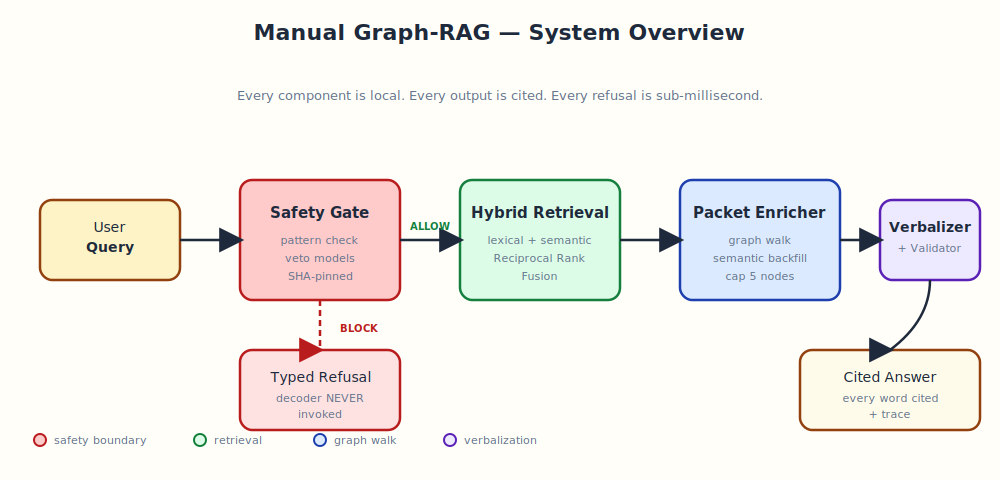

# Manual Graph-RAG — Inference Release

A safety-gated, citation-grounded question-answering system for product
manuals. **Runs entirely on the local machine.** No external API calls.
Every answer cites the exact node in the source manual it came from, and
the safety gate is verified to never invoke the decoder on a refusal.

This is the **inference-only release** — exactly the code and artifacts
needed to reproduce the demo recording, and nothing else. A fresh clone
runs offline out of the box.



---

## Highlights

- **Citation-grounded answers.** Every sentence carries a citation token
  that resolves to a specific node in the source manual graph. Validated
  per-sentence before display.
- **Safety perimeter.** A frozen, SHA-pinned safety gate runs first.
  Six layers of refusal (regex, term lexicon, learned vetoes). On a
  refusal the local decoder is never invoked. Sub-millisecond.
- **Hybrid retrieval.** Lexical token overlap + cosine over static
  embeddings, fused via weighted Reciprocal Rank Fusion. The same
  encoder runs offline (to build the index) and on-device (to embed
  queries), so retrieval quality on the embedded target is identical
  to the desktop demo.
- **Local generation.** A small autoregressive decoder runs greedily on
  CPU at ~3-4 seconds per answer. GPU inference, INT8 quantization, or
  a smaller decoder all reduce this latency without changing the safety
  surface.
- **Reproducibility.** Every answer's telemetry carries the frozen gate
  hash, the decoder checkpoint hash, the evidence packet hash, and the
  citation set. Two runs with the same query produce byte-identical
  answers.
- **Fully self-contained.** The repository ships the source code, the
  per-product graphs, the pre-built semantic indexes, the learned
  safety weights, the decoder checkpoint, and the static encoder. No
  network access required, ever.

## Repository layout

```
nexus-manual-release/
├── src/nexus_manual_release/        the inference stack
│   ├── cli.py                       demo CLI: ask / chat / demo-chat / prewarm
│   ├── runtime/                     gate, retrieval, enrichment, verbalizer
│   └── modeling/                    local decoder architecture
├── artifacts/
│   ├── products/                    per-product graphs + pre-built indexes
│   │   ├── electrolux_washer_dryer/graph/{nodes,edges,entities}.jsonl
│   │   ├── electrolux_washer_dryer/graph/semantic_index.npz
│   │   ├── electrolux_steam_oven/graph/{nodes,edges,entities}.jsonl
│   │   └── electrolux_steam_oven/graph/semantic_index.npz
│   └── safety/                      learned safety + wrong-entity weights
├── models/
│   ├── local_decoder.pt             small local decoder (~95 MB)
│   ├── tokenizer/                   decoder tokenizer
│   └── encoder/                     bundled static embedding encoder (~30 MB)
├── configs/
│   └── safety_gate.yaml             frozen safety-gate config (SHA-pinned)
├── docs/                            architecture + pipeline documentation
├── tests/                           end-to-end inference test suite
└── pyproject.toml
```

## Quick start

### Requirements

- Python 3.10 or newer
- Linux or macOS
- ~2 GB RAM during inference; ~125 MB on disk for this repository
- **No network access required** — every model and every index is
  bundled in the repository

### Install

```bash
git clone https://github.com/noliathain/nexus-manual-release.git
cd nexus-manual-release
pip install -e .
```

### Run the demo

```bash
HF_HUB_OFFLINE=1 nexus-manual demo-chat \
    --product electrolux_washer_dryer \
    --renderer nexus \
    --retrieval semantic
```

Then type questions at the prompt. The full demo question sequence used in
the recording is in [docs/demo_script.md](docs/demo_script.md).

### Pre-warm (optional, ~10 seconds)

Pre-loads the local decoder so the first answer in a live demo is at
steady-state latency (~3 seconds) instead of cold-load latency (~10
seconds). The semantic indexes are already bundled and load instantly.

```bash
nexus-manual prewarm
```

### Single-shot question

```bash
nexus-manual ask \
    --product electrolux_steam_oven \
    --renderer nexus \
    --retrieval semantic \
    --show-evidence --trace \
    "How do I clean the cavity?"
```

### Machine output

```bash
nexus-manual ask \
    --product electrolux_steam_oven \
    --renderer nexus \
    --retrieval semantic \
    --json \
    "How do I clean the cavity?"
```

Emits a single JSON object with the answer, citations, packet hash, and
full telemetry trace.

## Design principles

1. **The safety gate is the perimeter.** The decoder is never asked to
   refuse a query — it is never invoked on refusals. The gate decides;
   the decoder verbalizes only what the gate has already approved.
2. **Every word is cited.** Answers are anchored to specific evidence
   node IDs in the source graph. The validator rejects any sentence that
   doesn't carry a citation, and rejects any citation that doesn't
   resolve to a node in the approved packet.
3. **The same encoder runs offline and on-device.** Retrieval uses a
   static embedding model. The encoder used to build the index offline
   is the same encoder that runs at query time.
4. **The gate is frozen.** Its configuration carries a SHA-256 hash that
   is stamped into every answer's telemetry. Reproducibility holds as
   long as the hash holds.

## Reproducibility

Every answer's trace includes the fields needed to reproduce it byte-for-
byte:

| field | meaning |
|---|---|
| `runtime_config_hash` | SHA-256 of the safety-gate configuration |
| `nexus_model_hash` | SHA-256 prefix of the local decoder checkpoint |
| `evidence_packet_hash` | content hash of the assembled evidence packet |
| `decision` | ALLOW / BLOCK / REVIEW |
| `refusal_reason` | typed refusal class (or null on ALLOW) |
| `renderer_called` | whether the verbalizer was invoked |
| `decoder_called` | whether the local decoder produced text |
| `answer_validation_passed` | whether citation validation succeeded |
| `safety_veto_score` | learned safety-veto probability |
| `wrong_entity_veto_score` | learned wrong-product veto probability |
| `evidence_overlap` | query-to-evidence lexical overlap |
| `retrieval_mode` | "lexical" or "semantic" |
| `latency_ms` | wall-clock latency for the answer |

Any two runs with the same query, frozen gate hash, and frozen model
hash will produce byte-identical answers. The trace is the proof.

## Documentation

- **[Architecture](docs/architecture.md)** — component map, invariants,
  performance characteristics
- **[Inference pipeline](docs/pipeline.md)** — end-to-end pipeline with
  detailed diagrams and trace examples
- **[Offline design](docs/offline.md)** — build-time vs runtime split,
  embedded deployment path
- **[Demo script](docs/demo_script.md)** — exact question sequence used
  in the recording

## Testing

The release ships an end-to-end test suite that verifies bundle
integrity, offline operation, every refusal class, and the exact answer
text reproduced from the demo recording.

```bash
pip install pytest
HF_HUB_OFFLINE=1 pytest tests/
```

53 tests cover:

- **Bundle integrity** — every asset is present and frozen-hash-pinned
- **Imports** — package + runtime + CLI all importable under offline
- **Inference paths** — all demo answers reproduce, all six refusal
  classes verified
- **CLI** — `ask`, `chat`, `demo-chat`, `prewarm` smoke tested
- **Offline operation** — verified with HuggingFace cache absent

## Environment variables

| variable | purpose |
|---|---|
| `NEXUS_MANUAL_DECODER_PATH` | override path to the local decoder checkpoint |
| `NEXUS_MANUAL_TOKENIZER_PATH` | override path to the decoder tokenizer |
| `NEXUS_MANUAL_ENCODER_PATH` | override path to the static embedding encoder |
| `NEXUS_MANUAL_DEVICE` | `cpu` (default) or `cuda` |
| `HF_HUB_OFFLINE=1` | guarantees no network calls |
| `HF_HUB_DISABLE_PROGRESS_BARS=1` | suppresses any progress bars |

The defaults resolve to bundled assets under `models/` and `artifacts/`.
None of the env vars are required to run the demo.

## License

Apache 2.0. See [LICENSE](LICENSE).
