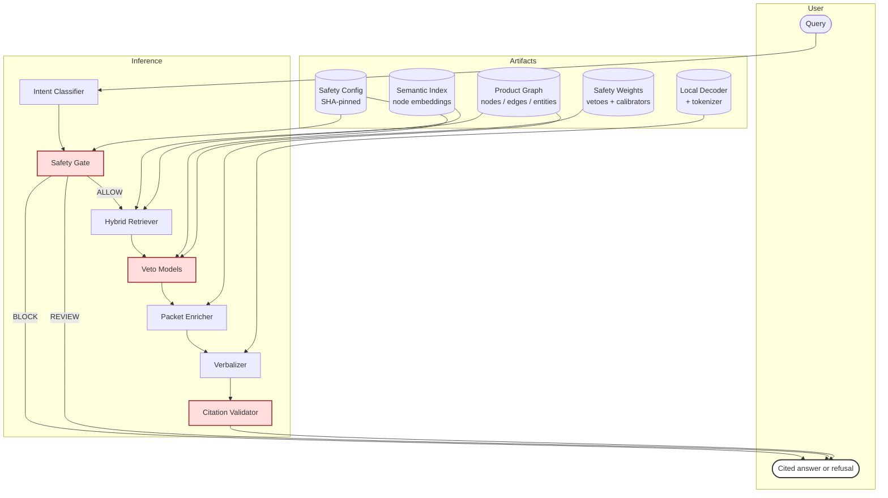

# Architecture

The Manual Graph-RAG inference stack is composed of five components in series.
The safety gate runs first; the decoder runs last and only when the gate has
approved an evidence packet.

## Component map

## Components

### 1. Intent classifier

A deterministic regex classifier that routes each query into one of:
`MAINTENANCE`, `PROCEDURE`, `SPEC_NUMERIC`, `ERROR_CODE`, `SAFETY`, or `OTHER`.
The intent informs the conversational opener selection downstream and is part
of the trace.

### 2. Safety gate

A deterministic pattern-match layer that detects:

- **prompt-injection patterns** — "ignore previous instructions", "system
  prompt", "jailbreak", etc.
- **unsupported repair requests** — "bypass", "disassemble", "rewire",
  "modify firmware", etc.
- **out-of-distribution queries** — queries with no lexical overlap against
  the product graph.

When the gate refuses, the request returns a typed refusal reason and **the
decoder is never invoked**. Refusal latency is sub-millisecond.

The safety-gate configuration is loaded from `configs/safety_gate.yaml` and its
SHA-256 hash is stamped into every answer's telemetry as
`runtime_config_hash`. Two runs with the same config hash will produce the
same gate decisions.

### 3. Hybrid retriever

The retriever fuses two ranking signals into a single top-1 evidence node:

1. **Lexical overlap** — Jaccard-style token-set overlap of the query against
   each candidate node's text.
2. **Semantic similarity** — cosine similarity over static embedding vectors
   produced by a small encoder (~8M parameters, 256-dim vectors). No
   transformer forward pass at retrieval time — the encoder is a vocab table
   with token-vector averaging.

The two ranked lists are combined with weighted Reciprocal Rank Fusion (RRF)
biased toward lexical, which empirically gives the best retrieval quality on
this corpus.

The semantic index is built offline (see [offline.md](offline.md)) and shipped
in this repository as a per-product `.npz` file under
`artifacts/products/<product>/graph/`.

### 4. Veto models

Two learned binary classifiers run on the selected primary node:

- **Safety veto** — small logistic-regression model that scores whether a
  non-safety-intent answer is at risk of relying on a safety-relevant evidence
  text.
- **Wrong-entity veto** — small logistic-regression model that scores whether
  the canonical entity attached to the selected node matches the bound
  product.

Both models load from JSON-serialized weights in `artifacts/safety/`. Their
scores appear in the trace as `safety_veto_score` and `wrong_entity_veto_score`.

### 5. Packet enricher

After the gate ALLOWs a primary node, the enricher walks the product graph for
related steps and assembles a richer **evidence packet**. It pulls neighbors
in this priority order:

1. Parent procedure / section (via `HAS_STEP` reverse, `PARENT_OF` reverse,
   `PART_OF` forward).
2. Sibling steps under the same parent.
3. Sequential next-step (`NEXT_STEP` forward).
4. Connected warnings (`HAS_WARNING` forward).
5. Connected specs / table rows (`HAS_SPEC`, `HAS_TABLE_ROW`).

When the primary node is a section-label fragment (short, no imperative verb),
the enricher does a **semantic backfill** — it scans the same product graph
for nodes whose text is strongly query-relevant and adds them to the packet
even if there's no explicit graph edge.

Each candidate is filtered for:

- **Product binding** — entity must match the bound product (or be unbound).
- **Safety-lex spillover** — non-warning neighbors are dropped if they carry
  dense safety lexicon into a non-safety answer.
- **Query relevance** — siblings must pass a low cosine threshold against the
  query (so a query about detergent doesn't drag in unrelated steps).
- **Bare section titles** — section / header / title nodes are demoted to
  metadata, not rendered as body sentences.
- **Imperative primary** — if the primary node text is already a complete
  imperative instruction, semantic backfill is skipped.

### 6. Verbalizer

The verbalizer produces a customer-facing answer from the assembled packet. It
uses a small local decoder (~8M parameters) running in greedy mode on CPU.

**Crucially: the decoder's raw output is consulted for tone only. Every
citation in the final answer is deterministically anchored to a node ID in the
assembled packet.** This means citation correctness is a property of the
runtime, not of the model.

Multi-step packets render as numbered Markdown lists. Single-step packets
render as inline prose. Conversational openers rotate deterministically across
a pool of 3–4 variants per intent, hashed by query so identical queries
produce identical answers.

### 7. Citation validator

Before display, the validator checks the proposed answer against three rules:

- **Citation subset rule** — every `[ev_N]` token in the answer must resolve
  to a node ID in the assembled packet.
- **Per-sentence citation rule** — every sentence over 30 characters must
  carry at least one citation token.
- **Wrong-product term rule** — the answer text must not contain any
  registered wrong-product term for the bound product.

If validation fails, the verbalizer falls back to the deterministic snippet
renderer (a simpler rule-based formatter), and the trace records
`renderer_fallback_used: true`.

## Invariants

The runtime is verified to maintain the following invariants:

| invariant | check |
|---|---|
| `runtime_config_hash` matches the frozen gate's SHA-256 | enforced at startup |
| `renderer_called == False` on every BLOCK / REVIEW | trace assertion |
| `decoder_called == False` on every BLOCK / REVIEW | trace assertion |
| `nexus_called == False` on every BLOCK / REVIEW | trace assertion |
| every citation in the answer ⊆ selected_evidence_node_ids | validator |
| no sentence over 30 chars without a citation | validator |
| no wrong-product term in the answer | validator |

## What the decoder is not

The local decoder is **not** a knowledge base. It does not produce facts; it
verbalizes facts that the safety gate has already approved and the packet
enricher has already assembled. The decoder's role is tone — making evidence
sentences flow as natural prose.

This means:

- Swapping the decoder for a different model of comparable size produces
  the same facts and the same citations; only the prose tone changes.
- The decoder's role is bounded by the validator. Anything it produces that
  fails citation validation is discarded.
- The decoder has no "system prompt" to leak — there's no instruction string
  the model has been trained to obey. The safety architecture lives in the
  gate, not in a prompt the model could be talked out of.

## Performance

Steady-state latency for ALLOW answers on CPU:

- Intent + gate + retrieval + enrichment: < 5 ms total
- Decoder generation: 3–4 seconds
- Validator + render: < 1 ms

Refusal latency: sub-millisecond (the decoder doesn't run).

The decoder is the dominant cost. GPU inference, INT8 quantization, or
swapping for a smaller decoder all reduce this without changing the safety
surface.
