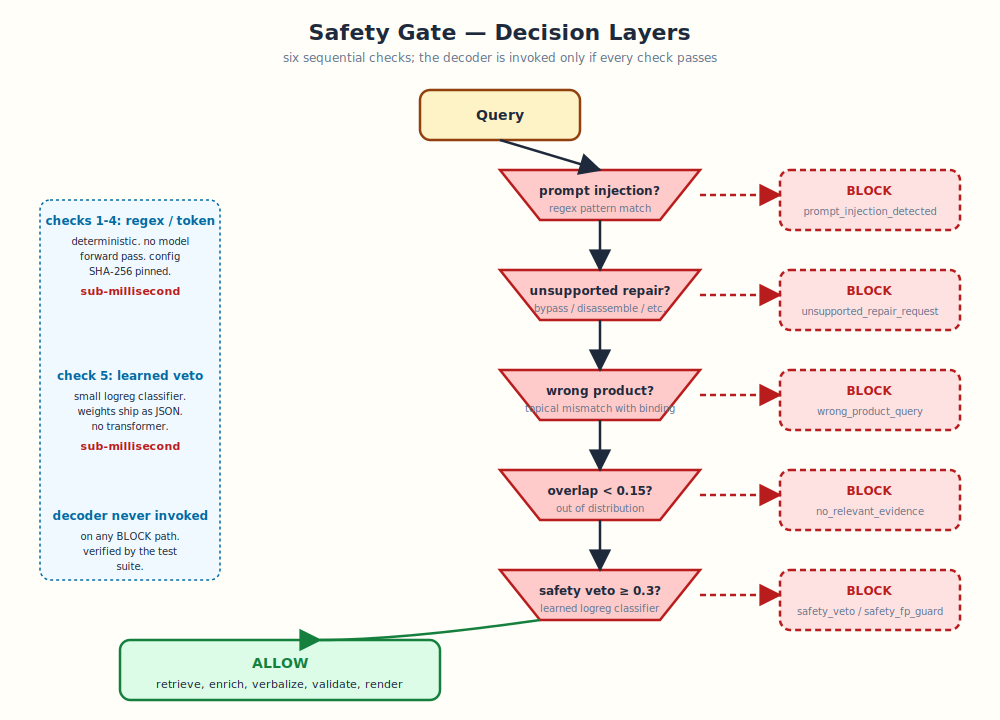

# Architecture

The Manual Graph-RAG inference stack is composed of six components in
series. The safety gate runs first; the local decoder runs last and only
when the gate has approved an evidence packet.

---

## The safety surface

The safety surface is the **gate**, not the **prompt**. Refusals are
detected and typed before any retrieval happens. The decoder is never
asked to refuse a query — it is never invoked on refusals.

This means:

- There is no "system prompt" the model has been trained to obey. A
  prompt-injection attack against the prompt is meaningless; there is
  no prompt to override.
- Refusals are sub-millisecond. The gate runs regex checks, term
  lexicon matches, and two small logistic-regression vetoes — no model
  forward pass.
- Refusals are typed. Every refusal has a named class
  (`unsupported_repair_request`, `prompt_injection_detected`,
  `wrong_product_query`, `no_relevant_evidence`, `safety_veto`,
  `wrong_entity_veto`). Downstream systems can route on the type.

## Components

### 1. Intent classifier

A deterministic regex classifier that assigns each query an intent label:
`MAINTENANCE`, `PROCEDURE`, `SPEC_NUMERIC`, `ERROR_CODE`, `SAFETY`, or
`OTHER`. The intent informs the conversational opener selection
downstream and is part of the trace.

### 2. Safety gate (deterministic)

Three regex-based checks run in series before any retrieval:

- Prompt-injection patterns (`ignore previous`, `system prompt`, ...)
- Unsupported-repair patterns (`bypass`, `disassemble`, ...)
- Term-lexicon for known wrong-product topics

If any check fires, the gate returns a BLOCK with a typed reason and the
decoder is never invoked.

### 3. Hybrid retriever

The retriever fuses two ranking signals into a single top-1 evidence
node:

- **Lexical overlap** — Jaccard-style token-set overlap of the query
  against each candidate node's text.
- **Semantic similarity** — cosine similarity over static embedding
  vectors. No transformer forward pass — the encoder is a vocabulary
  table with token-vector averaging.

The two ranked lists are combined via weighted Reciprocal Rank Fusion
biased toward lexical, which empirically gives the best retrieval
quality on the manual corpus.

The semantic index is built offline and shipped in this release as a
per-product `.npz` file under `artifacts/products/<product>/graph/`.

### 4. Veto models (learned)

Two small binary classifiers run on the retrieved primary node:

- **Safety veto** — flags non-safety queries whose evidence is
  safety-relevant.
- **Wrong-entity veto** — flags evidence whose canonical entity doesn't
  match the bound product.

Both are logistic-regression classifiers with hand-engineered features
(token overlap, warning-pattern density, capital-warning markers, intent
agreement). The weights ship as JSON under `artifacts/safety/`. Their
scores appear in the trace as `safety_veto_score` and
`wrong_entity_veto_score`.

### 5. Packet enricher

After the gate ALLOWs a primary node, the enricher walks the product
graph to assemble a richer **evidence packet**.

The walker pulls neighbors in this priority order:

1. Parent procedure / section (via `HAS_STEP` reverse, `PARENT_OF`
   reverse, `PART_OF` forward).
2. Sibling steps under the same parent (`HAS_STEP` forward).
3. Sequential next-step (`NEXT_STEP` forward).
4. Connected warnings (`HAS_WARNING` forward).
5. Connected specs / table rows (`HAS_SPEC`, `HAS_TABLE_ROW`).

When the primary node is a section-label fragment (short, no imperative
verb), the enricher does a **semantic backfill** — it scans the same
product graph for nodes whose text is strongly query-relevant and adds
them to the packet even if there is no explicit graph edge.

Each candidate is filtered for:

- **Product binding** — entity must match the bound product (or be
  unbound).
- **Safety-lex spillover** — non-warning neighbors are dropped if they
  carry dense safety lexicon into a non-safety answer.
- **Query relevance** — siblings must pass a low cosine threshold
  against the query.
- **Bare section titles** — section / header / title nodes are demoted
  to metadata, not rendered as body sentences.
- **Imperative primary** — if the primary node text is already a
  complete imperative instruction, semantic backfill is skipped.

### 6. Verbalizer

The verbalizer produces a customer-facing answer from the assembled
packet. It uses a small local decoder running in greedy mode on CPU.

**The decoder's raw output is consulted for tone only.** Every citation
in the final answer is deterministically anchored to a node ID in the
assembled packet. This means citation correctness is a property of the
runtime, not of the model. Swap the model — citations stay correct.

Multi-step packets render as numbered Markdown lists. Single-step
packets render as inline prose. Conversational openers rotate
deterministically across a pool of 3–4 variants per intent, hashed by
query so identical queries produce identical answers.

### 7. Citation validator

Before display, the validator enforces three rules:

If validation fails, the verbalizer falls back to the deterministic
snippet renderer (a simpler rule-based formatter that always passes by
construction), and the trace records `renderer_fallback_used: true`.

## Invariants

The runtime is verified to maintain the following invariants:

| invariant | enforcement |
|---|---|
| `runtime_config_hash` equals the frozen gate's SHA-256 | unit test |
| `renderer_called == False` on every BLOCK / REVIEW | integration test |
| `decoder_called == False` on every BLOCK / REVIEW | integration test |
| `nexus_called == False` on every BLOCK / REVIEW | integration test |
| every citation in the answer ⊆ `selected_evidence_node_ids` | validator + unit test |
| no sentence over 30 chars without a citation | validator |
| no wrong-product term in the answer | validator |
| refusal latency &lt; 50 ms | integration test |

All invariants are exercised by the test suite under `tests/`.

## Performance

Steady-state latency for ALLOW answers on CPU:

| stage | latency |
|---|---:|
| intent classifier | &lt; 0.5 ms |
| pattern-based safety gate | &lt; 0.5 ms |
| hybrid retrieval (190 nodes, top-K=8) | &lt; 2 ms |
| veto models (2 × logistic regression) | &lt; 0.5 ms |
| packet enrichment (graph walk + backfill) | &lt; 2 ms |
| **local decoder generation** | **~3–4 s** |
| citation validator | &lt; 1 ms |
| total ALLOW latency | ~3–4 s |
| total REFUSAL latency | &lt; 1 ms |

The decoder is the dominant cost on every ALLOW answer. GPU inference,
INT8 quantization, or swapping for a smaller decoder all reduce this
without changing the safety surface.

## What the decoder is not

The local decoder is **not** a knowledge base. It does not produce
facts; it verbalizes facts that the safety gate has already approved
and the packet enricher has already assembled.

This means:

- Swapping the decoder for a different model of comparable size produces
  the same facts and the same citations; only the prose tone changes.
- The decoder's role is bounded by the validator. Anything it produces
  that fails citation validation is discarded.
- The decoder has no system prompt to leak. The safety architecture
  lives in the gate, not in a string of instructions the model could be
  talked out of obeying.
