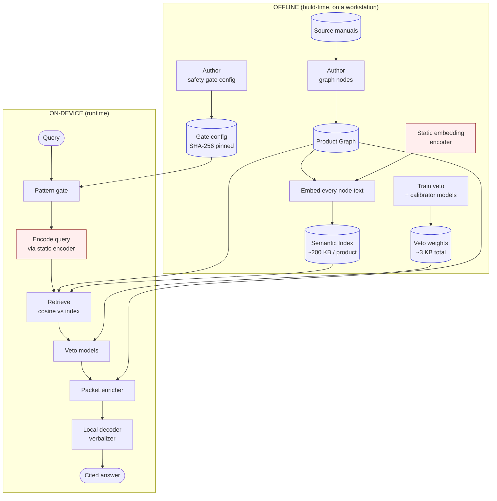

# Offline Design

The Manual Graph-RAG release splits cleanly into work that happens **offline,
at build time** and work that happens **on-device, at query time**. The
on-device side is small enough to run on embedded hardware; the offline side
can use a much larger embedding model because none of it travels to the
device.

## Build-time vs runtime split

## What runs offline (build-time)

These steps happen on a workstation. None of their output is required to be
small.

### Authoring the product graph

Each product manual is decomposed into a graph of **nodes** (instructional
sentences, section labels, warnings, specs, table rows) connected by
**edges** that capture the manual's structure:

- `HAS_STEP` — procedure → step
- `NEXT_STEP` — step → next step in sequence
- `PART_OF`, `PARENT_OF` — child → parent
- `HAS_WARNING` — node → safety warning
- `HAS_SPEC`, `HAS_TABLE_ROW` — node → numeric spec or table row
- `MENTIONS_ENTITY` — node → canonical product entity

Authoring is done once per manual.

### Building the semantic index

For each product graph, we encode every node's text once with a static
embedding model and persist the resulting matrix as a `.npz` file alongside
the graph. The index is:

- `node_ids`: int64 array, one per node
- `vectors`: float32 matrix, L2-normalized, shape `[num_nodes, embed_dim]`

For the products shipped in this release:

| product | nodes | index size |
|---|---:|---:|
| electrolux_washer_dryer | 190 | ~195 KB |
| electrolux_steam_oven | 165 | ~170 KB |

### Authoring the safety gate

The safety-gate configuration is a YAML file that declares:

- the pattern-match rules for prompt injection
- the pattern-match rules for unsupported repair requests
- the lexical-overlap thresholds for BLOCK / REVIEW / ALLOW
- the safety-veto and wrong-entity-veto threshold cutoffs
- the calibrator parameters for each decision class

This file is SHA-256 hashed and the hash is stamped into every answer's trace
as `runtime_config_hash`. Changing the gate config changes the hash.

### Training the veto models

The two veto models — safety-veto and wrong-entity-veto — are small
logistic-regression classifiers trained on a labeled set of (query, evidence)
pairs. Their learned weights are serialized to JSON (a few KB per model) and
loaded at runtime.

## What runs on-device (runtime)

These components run on every query. They are designed to be small, fast, and
free of network calls.

### Encoding the query

The query embedding is produced by a **static embedding model** (vocab
lookup + token-vector averaging). The same model that built the index runs
on-device for queries. No transformer forward pass; sub-millisecond on CPU.

The model is small enough to fit on the embedded target after INT8
quantization. Critically, **the same encoder runs both sides** — so retrieval
quality on the embedded build is identical to the workstation build.

### Retrieval

Cosine similarity between the query vector and the per-node vectors in the
pre-built index. For a 200-node product graph at 256-dim, this is a
~200 × 256 dot product — negligible on any device.

### Gate, veto, enrichment

These are pure-Python logic over the loaded graph and the JSON-serialized
weights. Total runtime cost: under 5 ms per query.

### Verbalizer

The local decoder is the heaviest on-device component:

- ~8M parameters
- ~95 MB on disk as FP32
- ~3 seconds per answer on CPU at greedy decoding

GPU inference, INT8 quantization, or swapping for a smaller decoder all
reduce this without changing the safety surface.

## Embedded deployment

For an embedded target (e.g. an MCU class device), the asymmetric design lets
each component be addressed independently:

| component | on-device path |
|---|---|
| Product graph | ship as `.jsonl` (compress to binary if needed) |
| Semantic index | ship as `.npz` (already small) |
| Static encoder | swap for INT8-quantized variant (~8 MB) or smaller |
| Gate config + veto weights | ship as JSON (a few KB) |
| Local decoder | INT8 quantize (~25 MB), or swap for smaller |
| Pure-Python logic | translate to embedded host language |

The build-time encoder used to produce the offline index can be **larger** than
the on-device encoder. In that asymmetric design, the offline encoder produces
high-quality vectors once; the on-device encoder is a distilled student that
maps queries into the same vector space. This is the recommended path for
production embedded deployments and is API-compatible with the runtime stack
shipped here.

## What does NOT run at runtime

For absolute clarity:

- **No model training** — all learned models are pre-trained offline.
- **No graph authoring** — graphs are pre-authored and shipped as data.
- **No external API calls** — no HuggingFace hub pings (when
  `HF_HUB_OFFLINE=1`), no LLM API calls, no analytics.
- **No PDF parsing, no markdown ingestion** — all of that is upstream of the
  graph artifacts shipped here.

The inference runtime in this release is purely a function from
`(query, product, retrieval_mode, renderer)` to `(answer, citations, trace)`.
