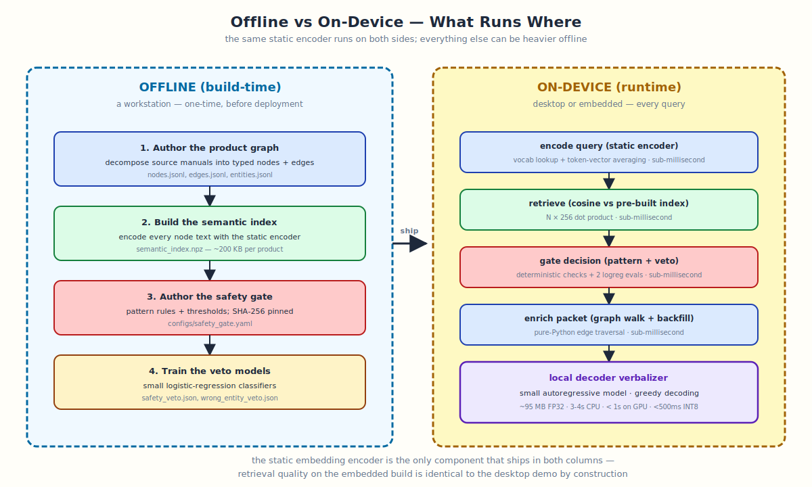

# Offline Design

The Manual Graph-RAG release splits cleanly into work that happens
**offline, at build time** and work that happens **on-device, at query
time**. The on-device side is small enough to run on embedded hardware;
the offline side can use a much larger embedding model because none of
it travels to the device.

**This release is fully self-contained.** Every model, every index, and
every config needed to reproduce the demo ships in the repository. A
clean machine with no internet access can clone, install, and run the
demo without any external service call.



---

## What runs offline (build-time)

These steps happen on a workstation. None of their output needs to be
small.

### Authoring the product graph

Each product manual is decomposed into a graph of **nodes**
(instructional sentences, section labels, warnings, specs, table rows)
connected by **edges** that capture the manual's structure:

| edge type | meaning |
|---|---|
| `HAS_STEP` | procedure → step |
| `NEXT_STEP` | step → next step in sequence |
| `PART_OF`, `PARENT_OF` | child → parent |
| `HAS_WARNING` | node → safety warning |
| `HAS_SPEC`, `HAS_TABLE_ROW` | node → numeric spec or table row |
| `MENTIONS_ENTITY` | node → canonical product entity |

Authoring is done once per manual and committed to
`artifacts/products/<product>/graph/`.

### Building the semantic index

For each product graph, every node text is encoded once with the static
embedding model and the resulting matrix is persisted as a `.npz` file
alongside the graph.

The index is:

- `node_ids`: int64 array, one per node
- `vectors`: float32 matrix, L2-normalized, shape
  `[num_nodes, embed_dim]`

For the products shipped in this release:

| product | nodes | index size |
|---|---:|---:|
| electrolux_washer_dryer | 190 | ~195 KB |
| electrolux_steam_oven | 160 | ~170 KB |

### Authoring the safety gate

The safety-gate configuration is a YAML file that declares:

- pattern-match rules for prompt injection
- pattern-match rules for unsupported repair requests
- lexical-overlap thresholds for BLOCK / REVIEW / ALLOW
- safety-veto and wrong-entity-veto threshold cutoffs
- calibrator parameters for each decision class

This file is SHA-256 hashed and the hash is stamped into every answer's
trace as `runtime_config_hash`. Changing the gate config changes the
hash; reproducibility holds as long as the hash holds.

### Training the veto models

The two veto models — safety-veto and wrong-entity-veto — are small
logistic-regression classifiers trained on a labeled set of (query,
evidence) pairs. Their learned weights are serialized to JSON (a few
KB per model) and loaded at runtime.

## What runs on-device (runtime)

These components run on every query. They are designed to be small,
fast, and free of network calls.

### Encoding the query

The query embedding is produced by a **static embedding model** —
vocabulary lookup + token-vector averaging. No transformer forward
pass; sub-millisecond on CPU.

The model is small enough to fit on the embedded target after INT8
quantization. **The same encoder runs both sides** — the offline index
and the on-device query encode — so retrieval quality on the embedded
build is identical to the workstation build.

### Retrieval

Cosine similarity between the query vector and the per-node vectors in
the pre-built index. For a 200-node product graph at 256 dimensions,
this is a ~200 × 256 dot product — negligible on any device.

### Gate, veto, enrichment

These are pure-Python logic over the loaded graph and the
JSON-serialized weights. Total runtime cost: under 5 ms per query.

### Verbalizer

The local decoder is the heaviest on-device component:

- small autoregressive model
- ~95 MB FP32 on disk
- ~3 seconds per answer on CPU at greedy decoding

GPU inference, INT8 quantization, or swapping for a smaller decoder
all reduce this without changing the safety surface.

## Embedded deployment

For an embedded target (e.g. an MCU-class device), the asymmetric design
lets each component be addressed independently:

| component | embedded path |
|---|---|
| product graph | ship as `.jsonl` (or convert to binary if size matters) |
| semantic index | ship as `.npz` (already small) |
| static encoder | INT8-quantize (~8 MB) or use a smaller variant |
| gate config + veto weights | ship as JSON (a few KB) |
| local decoder | INT8 quantize (~25 MB) or swap for a smaller model |
| pure-Python logic | translate to the embedded host language |

The build-time encoder used to produce the offline index **may be
larger** than the on-device encoder. In that asymmetric design, the
offline encoder produces high-quality vectors once; the on-device
encoder is a distilled student that maps queries into the same vector
space. This is the recommended path for production embedded
deployments. The runtime stack shipped here is API-compatible with
this swap.

## What does NOT run at runtime

For absolute clarity:

- **No model training** — all learned models are pre-trained offline.
- **No graph authoring** — graphs are pre-authored and shipped as data.
- **No external API calls** — no HuggingFace hub pings (when
  `HF_HUB_OFFLINE=1`), no LLM API calls, no analytics.
- **No PDF parsing, no markdown ingestion** — all of that is upstream
  of the graph artifacts shipped here.

The inference runtime in this release is purely a function from
`(query, product, retrieval_mode, renderer)` to
`(answer, citations, trace)`.

## Verifying offline operation

The test suite includes a dedicated `tests/test_offline_operation.py`
module that asserts every code path works with `HF_HUB_OFFLINE=1` set
and the HuggingFace cache absent.

```bash
HF_HUB_OFFLINE=1 pytest tests/test_offline_operation.py -v
```
